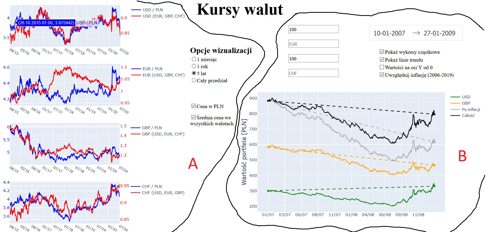

# Exchange rates dashboard

In this project I created a system for acquiring exchange rates data and a dashboard for visualizing them. To get the data I use _forex-python_ library which is built on the top of https://ratesapi.io API. Visualization is made with a use of Dash framework. 

Currencies considered in the project are: PLN, USD, EUR, GBP. CHF. 

Functionalities:

- Plotting prices of the currencies (USD, EUR, GBP, CHF) in PLN as well as in all the other currencies (averaged)
- Plotting value of investment in time considering inflation and components of all currencies

----

A - Visualization of currencies prices

B - Plotting investment value in time

